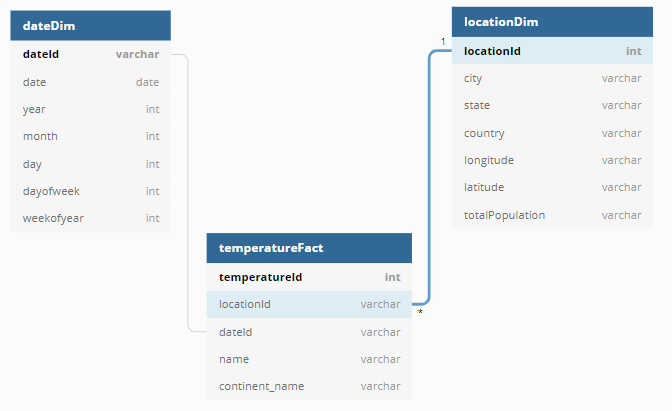

# Historical Temperature Data for Climate Change Analysis

#### Project Summary

The project follows the follow steps:
* Step 1: Scope the Project and Data Sources
* Step 2: Explore and Assess the Data
* Step 3: Define the Data Model
* Step 4: Run ETL to Model the Data
* Step 5: Complete Project Write Up

### Step 1: Scope the Project and Data Sources

#### Scope 
This project extracts and creates data model for the historical temperature data. The end goal is to have a data model that is suitable for answering questions about the data and is performant. To further enrich the data, a demographic data of US cities is added which allows joining finding. 

To achieve this, a star schema is used with one fact table and two dimension tables. Pyspark is used to extract and transform the data. The output is first written to S3 storage from where it is copied into a Redshift cluster.

#### Data  Source and Description

The data is a historical temperature data sourced from this [Kaggle account](https://www.kaggle.com/berkeleyearth/climate-change-earth-surface-temperature-data?select=GlobalLandTemperaturesByCity.csv). It was sourced by combining data from multiple sources and cleaning them. The data records average daily temperature for different cities of the world for 250 years.

### Step 2: Explore and Assess the Data
#### Explore the Data 
The temperature data has about 8.6 million records, 364 thousand of which had null values in their AverageTemperature and AverageTemperatureUncert columns.

#### Cleaning Steps
The following steps were observed to clean the data:
1. Date column is formatted as date column.
2. The records with nulls are removed.

### Step 3: Define the Data Model
#### 3.1 Conceptual Data Model
The project makes use of a star schema for its simplicity, performance, and reduced storage size. The model sets up a temperature facts table, and two dimensions tables - location and date.

#### 3.2 Mapping Out Data Pipelines
1. For the `dateDim` table, the date column is transformed to extract `year`, `month`, `day`, `dayofweek`, `weekofmonth` and `weekofyear`. A primary key is also added as a hashed value of the date column.
2. For the `locationDim` table, the `City`, `Country`, `Latitude` and `Longitude` columns are extracted and used to create a table with unique constraints the primary key which a hash of the `City` and `Country` strings concatenated.
3. The temperatureFact table is a table with a columns that serve as foreign keys to the two other tables. In addition, it has the `AverageTemperature` and `AverageTemperatureUncertainty` columns as the quantities of interest.

### Step 4: Run Pipelines to Model the Data 
#### 4.1 Create the data model
To run the data model, you need to run `python etl.py` from the command line.

#### 4.2 Data Dictionary
The data dictionary is linked [here](DataDictionary.md)
#### 4.3 Data Quality Checks
The following data quality checks are performed on the data:
 * Unique primary key integrity check on the relational database.
 * Count checks to ensure completeness

#### Step 5: Complete Project Write Up
##### Data schema Justification
> The choice of a star schema is made to ensure the data is stored in a lean format but also allows enrichment through joins with tables with relationships. As it is an analytical data, it is essential to use this approach to ensure analysis is sped up. The ERD for the data is shown below:



**Example Queries:**
1. Show the trend of weekly temperature average for each year
```sql
SELECT weekofyear, "year", AVG(averageTemperature) FROM
    temperatureFact T
JOIN dateDim D
    ON T.dateId == D.dateId
GROUP BY weekofyear, "year"
```

2. Find out if temperature rise has been a mjor cause of climate change over the years
```SQL
SELECT "year", AVG(averageTemperature) FROM
    temperatureFact T
JOIN dateDim D
    ON T.dateId == D.dateId
GROUP BY "year"
```
##### Rationale for Choice of Pyspark, S3 and Redshift
> Pyspark: This is chosen for its distributed computing support. It makes scaling up the data volume easy and not require a different approach.
> S3: Storing the intermediate output in S3 makes copying into Redshift database easily achievable.
> Redshift: Redshift database is chosen for its distributed nature, supporting linear scaling of storage volume and compute.

##### How often should the data be updated?
> Considering that new temperature data is available daily, it is necessary to run the etl on a daily basis.

##### How would I approach the problem differently under the following scenarios:
 **The data was increased by 100x**
 > The current choice of technologies are suitable for processing data of increasing scale, and thus, there will be no need to change the current approach.
 
 **The data populates a dashboard that must be updated on a daily basis by 7am every day**
 > Since the current set-up is recommended to be run on a daily basis, this will be adequate for populating such dashboard.
 
 **The database needed to be accessed by 100+ people**
 > The use of redshift is a good choice for scaling compute as demand grows. With over 100 people needing to access the database, the database performance will have to be assessed for performance and scaled up as required.
 
 #### Further Recommendation for ETL performance
 To gain a performance boost when running ETL, it is advisable to use an EMR (or EC2) cluster. This will significantly cut down the read and write times from and to S3. In that case, the script will be submitted to spark using `spark-submit etl.py`
